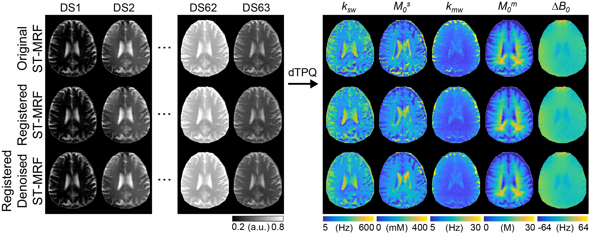

# Motion Registration and Denoising for ST-MRF
This repository provides the implementation of the motion correction and denoising pipeline used in the study: **"Physics-informed optimization of saturation-transfer MRI protocols using nondifferentiable Bloch models"** published in Physics in Medicine and Biology (2026).

https://iopscience.iop.org/article/10.1088/1361-6560/ae4285

---

## 🔍 Overview

The pipeline consists of two main stages to enhance the quality of multidimensional Magnetic Resonance Fingerprinting (MRF) data:

**1. Motion Registration (STN + NCC)**

Compensate for motion artifacts by registering all dynamic scans to a reference ($S_0$) image. It utilizes a Spatial Transformer Network (STN) optimized with a Normalized Cross-Correlation (NCC) loss.

**2. Denoising (MD-S2S)** 

Applies a self-supervised denoising technique (Multidimensional-Self2Self) to the registered images. This stage uses an optimization scheme where the network is trained and tested on the same dataset, making it applicable even without a large training corpus.

## Results

*Figure 1. Comparison of Original, Registered, and Registered+Denoised ST-MRF scans and their corresponding estimated tissue parameter maps.*

## Citation
If you use this code for your research, please cite:

@article{kang2026physics,
	author={Kang, Beomgu and Singh, Munendra and Seo, Hyunseok and Park, Hyun Wook and Heo, Hye-Young},
	title={Physics-informed optimization of saturation-transfer MRI protocols using non-differentiable Bloch models},
	journal={Physics in Medicine & Biology},
	year={2026}
}

@article{kang2024self,
  title={Self-supervised learning for denoising of multidimensional MRI data},
  author={Kang, Beomgu and Lee, Wonil and Seo, Hyunseok and Heo, Hye-Young and Park, HyunWook},
  journal={Magnetic resonance in medicine},
  volume={92},
  number={5},
  pages={1980--1994},
  year={2024},
  publisher={Wiley Online Library}
}
